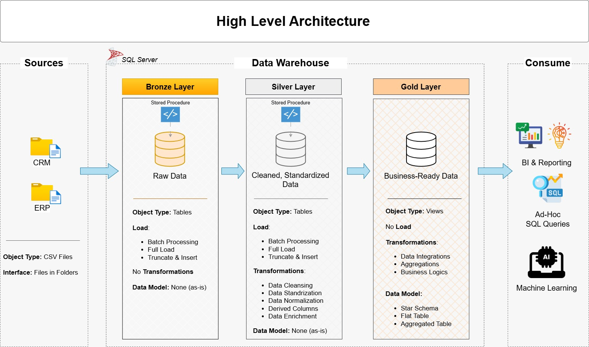

# Data Warehouse and Analytics Project

Welcome to the **Data Warehouse and Analytics Project** repository!

This project demonstrates an end-to-end **Data Warehouse and Analytics solution**, starting from data ingestion and transformation to generating analytical insights.

The project is designed as a **portfolio project** to showcase practical skills in **Data Engineering, Data Modeling, and SQL Analytics**, following industry best practices.

---

# Project Requirements

## 1. Building the Data Warehouse (Data Engineering)

### Objective
Develop a modern **Data Warehouse** using **SQL Server** to consolidate sales data from multiple source systems and enable efficient analytical reporting and data-driven decision-making.

### Specifications

#### Data Sources
Import data from two source systems:

- **ERP System**
- **CRM System**

The data is provided as **CSV files**.

#### Data Quality
Perform data cleaning and resolve common data quality issues such as:

- Missing values
- Duplicate records
- Data format inconsistencies

#### Data Integration
Integrate data from both systems into a **single analytical data model** that is optimized for analytical queries and reporting.

#### Scope
The project focuses only on the **latest available dataset**.

Historical tracking (**historization**) is **not required** in this project.

#### Documentation
Provide clear documentation of the **data model**, including:

- Table descriptions
- Column definitions
- Relationships between tables

This documentation supports both:

- Business stakeholders
- Analytics teams

---
### BI: Analytics & Reporting (Data Analysis)

#### Objective
Develop SQL-based analytics to deliver detailed insights into:
- **Customer Behavior**
- **Product Performance**
- **Sales Trends**

These insights empower stakeholders with key business metrics, enabling strategic decision-making.  

For more details, refer to [docs/requirements.md](docs/requirements.md).

-----

## 🏗️ Data Architecture



The data architecture for this project follows the **Medallion Architecture**, which organizes data into three layers: **Bronze, Silver, and Gold**.

### 🥉 Bronze Layer (Raw Data Layer)
The Bronze layer stores raw data exactly as it is received from the source systems.  
In this project, data is ingested from **CSV files** and loaded directly into a **SQL Server database** without transformations.  
This layer acts as the historical record of the source data.

### 🥈 Silver Layer (Cleaned and Standardized Data)
The Silver layer is responsible for data cleansing, transformation, and normalization.  
In this stage, inconsistencies, missing values, and formatting issues are resolved.  
The data is standardized and structured to ensure accuracy and consistency for downstream processes.

### 🥇 Gold Layer (Business-Ready Data)
The Gold layer contains curated, business-ready datasets optimized for analytics and reporting.  
Data in this layer is modeled using a **Star Schema**, making it suitable for business intelligence tools and analytical queries.

------

## 📂 Repository Structure
```
data-warehouse-project/
│
├── datasets/                           # Raw datasets used for the project (ERP and CRM data)
│
├── docs/                               # Project documentation and architecture details
│   ├── etl.drawio                      # Draw.io file shows all different techniquies and methods of ETL
│   ├── data_architecture.drawio        # Draw.io file shows the project's architecture
│   ├── data_catalog.md                 # Catalog of datasets, including field descriptions and metadata
│   ├── data_flow.drawio                # Draw.io file for the data flow diagram
│   ├── data_models.drawio              # Draw.io file for data models (star schema)
│   ├── naming-conventions.md           # Consistent naming guidelines for tables, columns, and files
│
├── scripts/                            # SQL scripts for ETL and transformations
│   ├── bronze/                         # Scripts for extracting and loading raw data
│   ├── silver/                         # Scripts for cleaning and transforming data
│   ├── gold/                           # Scripts for creating analytical models
│
├── tests/                              # Test scripts and quality files
│
├── README.md                           # Project overview and instructions
├── LICENSE                             # License information for the repository
├── .gitignore                          # Files and directories to be ignored by Git
└── requirements.txt                    # Dependencies and requirements for the project
```
---

# License

This project is licensed under the **MIT License**.

You are free to:

- Use
- Modify
- Share
------

# 🌟 About Me

Hi, I'm **Bahgat Zakaria** 👋

I am a **Data Engineering enthusiast** with a strong interest in building **Data Warehouses** and **ETL pipelines**.

I enjoy working with data, transforming **raw datasets** into **structured and meaningful insights**.

🎯 **My Goal**  
My goal is to become a **professional Data Engineer** and build **scalable data systems**.


## 🔗 Connect with Me

- LinkedIn: [Bahgat Zakaria](https://www.linkedin.com/in/amir-zakaria-70a03a295?utm_source=share_via&utm_content=profile&utm_medium=member_android)
